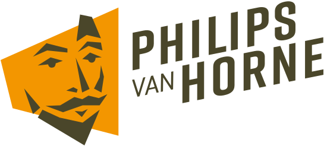

<a name="readme-top"></a>

[![Contributors][contributors-shield]][contributors-url]
[![Forks][forks-shield]][forks-url]
[![Stargazers][stars-shield]][stars-url]
[![Issues][issues-shield]][issues-url]
[![MIT License][license-shield]][license-url]


<!-- PROJECT LOGO -->
<br />
<div align="center">
  <a href="https://github.com/philipsvanhorne/nieuws_api">
    
  </a>

<h3 align="center">PvH nieuws scraper</h3>

  <p align="center">
    Een nieuwsberichten scraper voor de website van het Philips van Horne SG.
    <br />
    <a href="https://github.com/philipsvanhorne/nieuws_api"><strong>Verken de documentatie »</strong></a>
    <br />
    <br />
    <a href="https://informatica.lvo-weert.nl/">Bekijken</a>
    ·
    <a href="https://github.com/philipsvanhorne/nieuws_api/issues">Meld een probleem</a>
    ·
    <a href="https://github.com/philipsvanhorne/nieuws_api/issues">Functie aanvragen</a>
  </p>
</div>


<!-- TABLE OF CONTENTS -->
<details>
  <summary>Inhoud</summary>
  <ol>
    <li>
      <a href="#about-the-project">Over Het Project</a>
      <ul>
        <li><a href="#built-with">Gemaakt Met</a></li>
      </ul>
    </li>
    <li>
      <a href="#getting-started">Getting Started</a>
      <ul>
        <li><a href="#prerequisites">Vereisten</a></li>
        <li><a href="#installation">Installatie</a></li>
      </ul>
    </li>
    <li><a href="#usage">Gebruik</a></li>
    <li><a href="#roadmap">Roadmap</a></li>
    <li><a href="#contributing">Contributing</a></li>
    <li><a href="#license">Licentie</a></li>
    <li><a href="#contact">Contact</a></li>
    <!-- <li><a href="#acknowledgments">Acknowledgments</a></li> -->
  </ol>
</details>


<!-- OVER HET PROJECT -->
## Over het project

[![Product Name Screen Shot][product-screenshot]](https://pvanhorne.nl/leerlingen/nieuws-1)

Een simpele scraper voor de nieuwsberichten op de website van het Philips van Horne SG.

<p align="right">(<a href="#readme-top">terug naar boven</a>)</p>


### Gemaakt met

* [![Rust][Rust]][Rust-url]

<p align="right">(<a href="#readme-top">terug naar boven</a>)</p>


<!-- GETTING STARTED -->
## Getting Started

Voor het opzetten van het project volg je de volgende stappen.

### Vereisten

* Rust
* Cargo

### Installatie

1. Clone de repo
   ```sh
   git clone https://github.com/philipsvanhorne/nieuws_api.git
   ```
2. Run de api
   ```sh
   cargo run
   ```

<p align="right">(<a href="#readme-top">terug naar boven</a>)</p>


<!-- USAGE EXAMPLES -->
## Usage

De API is te gebruiken door iedereen zodra deze draait.

De API heeft de volgende endpoints:
* `/api/news/:page` - Geeft alle nieuwsberichten terug voor de opgegeven pagina

<p align="right">(<a href="#readme-top">terug naar boven</a>)</p>


<!-- ROADMAP -->
## Roadmap

- [x] Nieuwsberichten ophalen voor elke pagine
- [ ] Kalender ophalen

Zie de [open problemen](https://github.com/philipsvanhorne/nieuws_api/issues) voor een volledige lijst met voorgestelde functies (en bekende problemen).

<p align="right">(<a href="#readme-top">terug naar boven</a>)</p>


<!-- CONTRIBUTING -->
## Contributing


Contributies zijn wat de open source community zo'n geweldige plek maakt om te leren, inspireren en creëren. Alle bijdragen die je maakt worden **zeer gewaardeerd**.

Als je een suggestie hebt die dit beter zou maken, fork dan de repo en maak een pull request. Je kunt ook gewoon een issue openen met de tag "enhancement".
Vergeet niet om het project een ster te geven! Nogmaals bedankt!

1. Fork het project
2. Maak een nieuwe branch (`git checkout -b feature/AmazingFeature`)
3. Commit je veranderingen (`git commit -m 'Add some AmazingFeature'`)
4. Push naar de branch (`git push origin feature/AmazingFeature`)
5. Open een pull request
6. Wacht tot je pull request is geaccepteerd

<p align="right">(<a href="#readme-top">terug naar boven</a>)</p>


<!-- LICENSE -->
## License

Gedistribueerd onder de MIT License. Zie `LICENSE.txt` voor meer informatie.

<p align="right">(<a href="#readme-top">terug naar boven</a>)</p>


<!-- CONTACT -->
## Contact

Yurki Montero Montero - [@djoerkie](https://twitter.com/djoerkie)

Project Link: [https://github.com/philipsvanhorne/nieuws_api](https://github.com/philipsvanhorne/nieuws_api)

<p align="right">(<a href="#readme-top">terug naar boven</a>)</p>


<!-- ACKNOWLEDGMENTS -->
<!-- ## Acknowledgments

* []()
* []()
* []()

<p align="right">(<a href="#readme-top">terug naar boven</a>)</p> -->


<!-- MARKDOWN LINKS & IMAGES -->
<!-- https://www.markdownguide.org/basic-syntax/#reference-style-links -->
[contributors-shield]: https://img.shields.io/github/contributors/philipsvanhorne/nieuws_api.svg?style=for-the-badge
[contributors-url]: https://github.com/philipsvanhorne/nieuws_api/graphs/contributors
[forks-shield]: https://img.shields.io/github/forks/philipsvanhorne/nieuws_api.svg?style=for-the-badge
[forks-url]: https://github.com/philipsvanhorne/nieuws_api/network/members
[stars-shield]: https://img.shields.io/github/stars/philipsvanhorne/nieuws_api.svg?style=for-the-badge
[stars-url]: https://github.com/philipsvanhorne/nieuws_api/stargazers
[issues-shield]: https://img.shields.io/github/issues/philipsvanhorne/nieuws_api.svg?style=for-the-badge
[issues-url]: https://github.com/philipsvanhorne/nieuws_api/issues
[license-shield]: https://img.shields.io/github/license/philipsvanhorne/nieuws_api.svg?style=for-the-badge
[license-url]: https://github.com/philipsvanhorne/nieuws_api/blob/master/LICENSE.txt
[product-screenshot]: images/screenshot.png
[Rust]: https://img.shields.io/badge/Rust-000000?style=for-the-badge&logo=rust&logoColor=white
[Rust-url]: https://www.rust-lang.org/